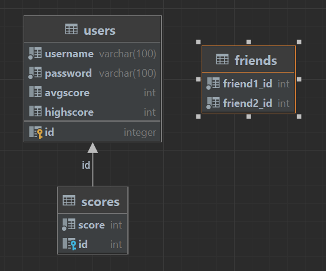

# Reakt - Dokumentation

Verfasser: **Amadeus Abdulkarim**

Datum: **26.01.2023**

## Anforderungen

FLASK ist das Framework womit die API geschrieben wurde:

<code>
pip install flask
</code>

Damit werden CORS Errors vermieden:

<code>
pip install flask_cors
</code>

## Einführung

Eine Webseite, Reakt soll die Reaktionszeit der User Testen und in einer Datenbank speichern.

## Projektbeschreibung

Reakt Webseite, welche die Reaktionszeit des Users durch rechtzeitigem Klicken testet, die Zeiten aufzeichnet und in einer Datenbank speichert. Das Projekt gilt als Übung zum Backend und benachteiligt daher das Frontend.

Das Backend besteht aus einer REST API und einem SQL Reader der die Datenbank liest
Das Frontend liest die Daten von der Rest-API und stellt sie übersichtlich dar.

## Das Backend
### API

Die Datenbank wird auf dem Localhost gespeichert, weswegen die API Root-URL https://172.0.0.1:5000/ ist.

### Datenbank

TABLE friends besteht aus 2 id coloumns und bilden eine Freundschaft.

TABLE users speichert ein username und ein password mit dem Primary Key id

TABLE scores speichert die Punkte (Millisekunden) die man beim Test erreicht. Dabei gibt es einen Foreign Key mit der Reference zu der id von users

## Das Frontend

Das Frontend ist eine Website die durch API Calls Funktionalität und Datenanzeige erfüllt. Verwendete Frameworks sind UIKit(Style) und AJAX für JQuery und API GET Calls

## Quellen

https://stackoverflow.com/

*SQLite cheat sheet* (2020) *SQLite Tutorial*. Available at: https://www.sqlitetutorial.net/sqlite-cheat-sheet/ (Accessed: January 21, 2023). 

*Using SQLite 3 with Flask - Flask Documentation (2.2)*. Available at: https://flask.palletsprojects.com/en/2.2.x/patterns/sqlite3/ (Accessed: January 21, 2023). 

*Python Flask Tutorial #2 - Routing*. Available at: https://www.youtube.com/watch?v=EMcTreG8N3g (Accessed: January 25, 2023)

*Python Flask Tutorial #5 - HTTP GET und POST*. Available at: https://www.youtube.com/watch?v=BOKYL5vfQX4 (Accessed: January 25, 2023)